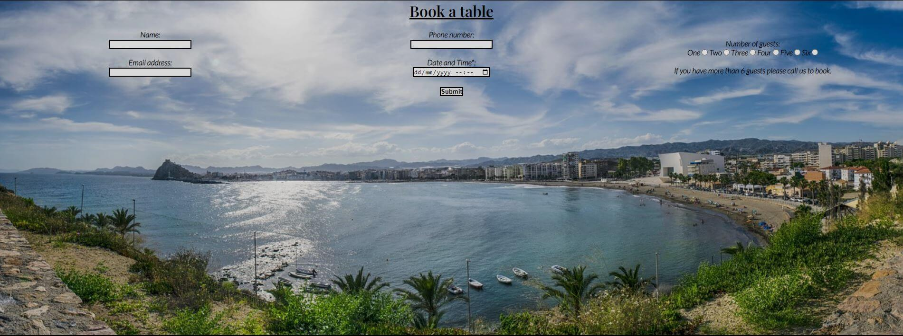

# Pizzeria Etna Website
Pizzeria Etna website's purpose is to improve overall awareness of the restaurant in the area to increase the number of visitors and to help it stand out from the competition. Many of the restaurants in or around Aguilas use Facebook instead of their own website. The website will allow users to find the restaurant, browse the menu and book a table. 

[View Pizzeria Etna on Github Pages](https://github.com/harry-c26/pizzeria-etna)

##  Features

### Navigation

*  Users will find all of the links at the top of the page for easy navigation through the website. 
*  The Logo, Home, Menu and Book a table links take you to the relevant pages on the site.
*  The logo brings in the first part of the Italian theme with Mount Etna as part of the logo 

### About us section

*  This starts with the header in large bold font tells the users the name of the restaurant and is clear in case the logo doesn't load.  
*  The About Us section provides the users with information about the restaurant.
*  Key information including history, what differentiates them from other pizzerias and the awards they've been awarded.

### Where to find us

*  The Where to find us section starts with an interactive Google map showing the location of the restaurant.
*  This section also includes the opening times, address and contact information.

### The footer

*  The footer is a main theme of the website bringing in the Italian flag colours which are used in key sections of the homepage.
*  The colour scheme represents the authentic Italian recipes and ingredients.
*  In the middle of the footer are the social media icons. Each icon opens a new page to facebook, instrgram and tripadvisor.

### Menu page

*  The menu page provides users with the options for starters, mains and dessert.
*  Along with the food items there are images of the dishes from each section so users can see what they'll get when they visit.

### Book a table page

*  The book a table page have an image of Aguilas as the background which ties together Italian origins and Spanish location.
*  At the top of the background is the booking form so users can book a table at the restaurant.

## Testing

*  The website has been tested on chrome, edge and firefox and has the same appearance on all browsers.
*  The links all work and take you to the relevant page.
*  The website is responsive to different screen sizes and keeps a common layout on them.
*  The booking form works and will only submit when all of the fields are filled out with the correct information. 

## Validator testing

*  It has been tested on the HTML validator and has passed with 1 note regarding language when the website is set to English. As this is for menu items for an Italian restaurant I ignored this warning.
*  It has been tested on the CSS validator and has passed as well.
*  I have checked the website is responsive and functions on a variety of screen sizes using AmIResponsive as well as the inspection devtools.
*  I have also checked the site with Lighthouse which gave an overall score of 97 for accessibility. 

W3 HTML checks:

CSS checks:

Lighthouse check:

## Bugs

### Solved bugs

* The main issue I had was the booking page having poor accessibility scoring. First I tried to adjust the code myself but none of the attempts worked so I looked online and found a fix as listed below. 

### Unfixed bugs

* There are no bugs with the site that I'm aware of. 

## Credits

### Content

* The code for the social media links was taken from the [CI Love Running project](https://github.com/harry-c26/love-running)
* To fix the contrast between the text and background image on the booking page I used the code from [here](https://coder-coder.com/background-image-opacity/)
* The code used to get the google map for the homepage was aided by [this Youtube video](https://www.youtube.com/watch?v=4U_AAGHzTok)
* The colours for the Italian flag in the footer came from [here](https://www.flagcolorcodes.com/italy#:~:text=What%20are%20the%20colors%20of,are%20green%2C%20white%20and%20red)
* The footer layout and styling was from the [w3schools how to site](https://www.w3schools.com/howto/howto_css_three_columns.asp)
* To create the grid for the menu I used a [grid generator](https://grid.layoutit.com/) to give the base layout ready for styling and filling

### Media

* The caprese image was taken from [Pixabay](https://pixabay.com/es/photos/queso-mozzarella-ensalada-caprese-5218979/)
* The background image on the booking page was taken from [Pixabay](https://pixabay.com/photos/landscape-bay-beach-darling-clouds-5277781/)
* All other images were provided by the owners of Pizzeria Etna.

### Others to mention

* A special thank you to Sheryl for the advice and points she gave me to look into flex box and flex grid as options for the menu page
* The [README guide](https://github.com/kera-cudmore/readme-examples#credits) that Kera Cudmore put together was a great help as well 

## Further development plans

* Improve the quality of the photos on the menu page
* Add an ordering page for collections
* Expand the home page with adjustments to the about us section with images of the owners and restaurant and adding an awards section for the ones they've received from Tripadvisor.

## Things I've learned from my project

* Definitely start writing the README file at the start as part of my planning and use it as a working document.
* Breaking the page down into smaller sections and fully completing the header before moving onto the body for example. 
* Committing in smaller chunks and more often. 
